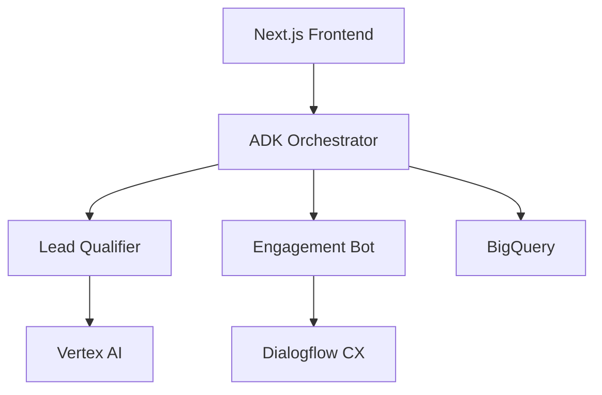

# Albatross: AI-Powered CRM with Google ADK

 

A modern, AI-powered CRM supercharged with Google's Agent Development Kit.

## 🏆 Hackathon Submission: Google ADK Challenge  
**Category:** Customer Service and Engagement  
**Technology Stack:** Google ADK (Python) + Next.js + Google Cloud  

## 🌟 Key Features  

### Multi-Agent System Powered by Google ADK  
- 🤖 **Lead Qualification Agent**: AI-driven lead scoring with Vertex AI integration  
- 💬 **Engagement Orchestrator**: Coordinates cross-channel customer interactions  
- 📈 **Pipeline Optimizer**: Real-time sales funnel analysis and suggestions  
- ⚡ **Energy Tracker**: Predictive lead "energy" monitoring  

### Enhanced CRM Capabilities  
- 🔗 Automated Google Cloud integrations (BigQuery, Dialogflow CX)  
- 🔄 Intelligent workflow automation between agents  
- 📊 Enhanced analytics with Looker Studio integration  
- 🗣️ Natural language processing for customer interactions  

## 🛠️ Tech Stack  

### Core Platform  
- **Frontend:** Next.js 14 (App Router)  
- **Styling:** Tailwind CSS + ShadCN/ui  
- **State Management:** Zustand  

### Google ADK Integration  
- **Agent Development Kit (Python)**  
- **Dialogflow CX** for conversation management  
- **Vertex AI** for machine learning  
- **BigQuery** for data analysis  

## 🚀 Getting Started  

### Prerequisites  
- Node.js 18.x+  
- Python 3.10+  
- Google Cloud account  
- ADK SDK installed  

### Installation  

Clone the repository:  

```bash
git clone https://github.com/your-username/albatross-crm-adk.git
cd albatross-crm-adk
```

Install dependencies:  

```bash
# Frontend
npm install

# Backend/ADK
pip install -r agents/requirements.txt
```

Set up Google Cloud:  

```bash
gcloud auth login
gcloud config set project YOUR_PROJECT_ID
```

Configure environment:  

```bash
cp .env.example .env.local
# Fill in your Google Cloud credentials
```

## 🏗️ Project Structure  

```text
albatross-crm-adk/
├── app/                  # Next.js application
├── agents/               # ADK Python agents
│   ├── lead_qualifier/   # Lead scoring agent
│   ├── engagement_bot/   # Customer interaction agent
│   ├── pipeline_ai/      # Optimization agent
│   └── energy_tracker/   # Lead energy monitoring
├── google_cloud/         # GCP integration scripts
├── types/                # Shared TypeScript types
└── public/               # Static assets
```

## 🔥 Running the System  

Start the frontend:  

```bash
npm run dev
```

Launch ADK agents (in separate terminals):  

```bash
# Agent 1
python agents/lead_qualifier/main.py

# Agent 2
python agents/engagement_bot/main.py

# Agent 3
python agents/pipeline_ai/main.py
```

Access the system at **http://localhost:3000**  

## 🎥 Demo Highlights  

### Multi-Agent Lead Processing  
Watch how leads flow through qualification → engagement → pipeline optimization  

### Real-time Energy Tracking  
Visual demonstration of lead "energy" changes based on agent interactions  

### Automated Customer Touchpoints  
Showcase scheduled follow-ups triggered by agent coordination  

## 📊 Google Cloud Integration  



## 🤝 Contributing  

1. **Fork the project**  
2. **Create your feature branch**  
   ```bash
   git checkout -b feature/AmazingFeature
   ```
3. **Commit your changes**  
   ```bash
   git commit -m 'Add some AmazingFeature'
   ```
4. **Push to the branch**  
   ```bash
   git push origin feature/AmazingFeature
   ```
5. **Open a Pull Request**  

## 📄 License  

Distributed under the MIT License. See [LICENSE](LICENSE) for more information.  

## Contact
Sanelisiwe Sileku - [@Sanelisiwe71701](https://x.com/Sanelisiwe71701) - sanelisiwe.sileku@gmail.com

Project Link: https://github.com/sanerita/ALBATROSSAI

